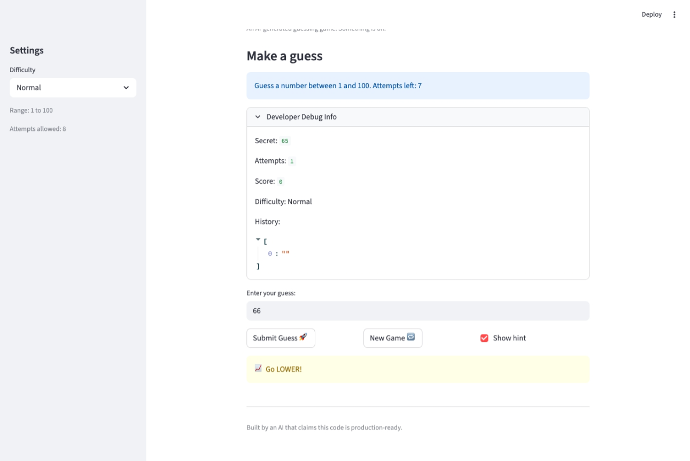
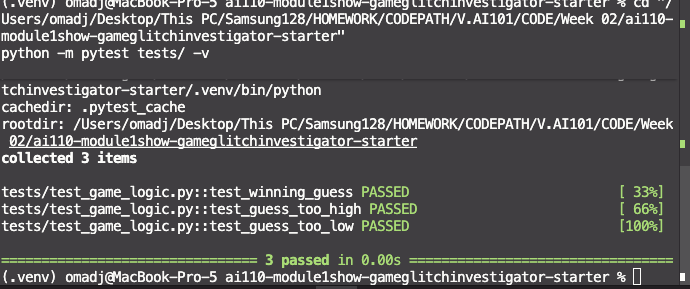

# 🎮 Game Glitch Investigator: The Impossible Guesser

## 🚨 The Situation

You asked an AI to build a simple "Number Guessing Game" using Streamlit.
It wrote the code, ran away, and now the game is unplayable. 

- You can't win.
- The hints lie to you.
- The secret number seems to have commitment issues.

## 🛠️ Setup

1. Install dependencies: `pip install -r requirements.txt`
2. Run the broken app: `python -m streamlit run app.py`

## 🕵️‍♂️ Your Mission

1. **Play the game.** Open the "Developer Debug Info" tab in the app to see the secret number. Try to win.
2. **Find the State Bug.** Why does the secret number change every time you click "Submit"? Ask ChatGPT: *"How do I keep a variable from resetting in Streamlit when I click a button?"*
3. **Fix the Logic.** The hints ("Higher/Lower") are wrong. Fix them.
4. **Refactor & Test.** - Move the logic into `logic_utils.py`.
   - Run `pytest` in your terminal.
   - Keep fixing until all tests pass!

## 📝 Document Your Experience

- [x] Describe the game's purpose.
- [x] Detail which bugs you found.
- [x] Explain what fixes you applied.

### Game Purpose

A Streamlit-based number guessing game where the player picks a difficulty (Easy, Normal, Hard), and tries to guess a secret number within a limited number of attempts. The app gives "Higher" or "Lower" hints after each guess and tracks the player's score.

### Bugs Found

1. **Swapped hints** — When the guess was too high, the game said "Go HIGHER!" and vice versa, leading the player further from the answer.
2. **Secret became a string on even attempts** — On every other guess, the secret was converted to a string, causing `int` vs `str` comparison. This broke hint logic because string comparison is alphabetical (e.g., `"5" > "42"` is `True`).
3. **New Game button was broken** — It did not reset `status`, `score`, or `history`. After winning or losing, the game was permanently stuck because `st.stop()` blocked all interaction.
4. **New Game ignored difficulty** — It always generated a secret in the range 1-100, regardless of the selected difficulty.
5. **Hard mode was easier than Normal** — Hard used range 1-50 while Normal used 1-100, making Hard actually easier.
6. **Inconsistent "Too High" scoring** — "Too Low" always cost -5 points, but "Too High" alternated between +5 and -5 depending on attempt parity.
7. **Off-by-one in win score** — The formula `100 - 10 * (attempt_number + 1)` deducted an extra 10 points. Winning on attempt 1 gave 80 instead of 90.
8. **Hardcoded range in info bar** — The UI always displayed "Guess a number between 1 and 100" regardless of difficulty setting.

### Fixes Applied

1. Swapped the hint messages so "Too High" says "Go LOWER!" and "Too Low" says "Go HIGHER!".
2. Removed the `if attempts % 2 == 0` block that converted the secret to a string. Also removed the `TypeError` except block in `check_guess()` that was no longer needed.
3. Added `status = "playing"`, `score = 0`, and `history = []` resets to the New Game handler.
4. Changed `random.randint(1, 100)` to `random.randint(low, high)` in the New Game handler.
5. Changed Hard range from `1, 50` to `1, 500`.
6. Made "Too High" consistently return `current_score - 5`, matching "Too Low".
7. Removed the `+ 1` from the win score formula: `100 - 10 * attempt_number`.
8. Replaced hardcoded `"1 and 100"` with `f"{low} and {high}"` in the info bar.
9. Refactored all logic functions into `logic_utils.py` and updated `app.py` to import them. Fixed tests to unpack the tuple return from `check_guess()`.

## 📸 Demo

## 🚀 Stretch Features

- [ ] [If you choose to complete Challenge 4, insert a screenshot of your Enhanced Game UI here]
